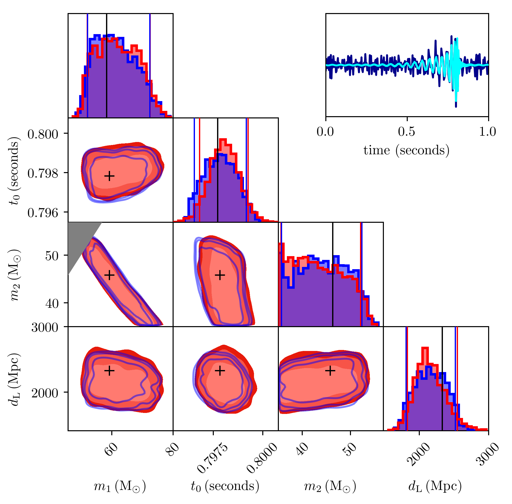

<a href="https://arxiv.org/abs/1909.06296">
    
</a>

# VItamin
:star: Star us on GitHub — it helps!

VItamin is a LIGO tool for predicting parameter 
posteriors given a gravitational wave time series 
using a form of machine learning known as conditional 
variational autoencoders. 
It produces training/testing sets, trains on those 
sets and compares its predictions to those 
from the bilby Bayesian inference library. Once trained, 
the machine learning model will be able to produce 
posteriors 6-7 orders of magnitudes faster than existing 
techniques.

<a href="https://arxiv.org/abs/1909.06296">
    
</a>

## Table of contents
- [Installation](#installation)
- [Usage](#usage)
- [Making Training Sets](#making-training-sets)
- [Making Testing Sets](#making-testing-sets)
- [Training Machine Learning Model](#training-machine-learning-model)
- [Producing Results Plots](#producing-results-plots)
- [License](#license)
- [Links](#links)

## Installation

The prefered method of installation is via the 
anaconda package manager. An alternative method 
using pip and virtualenv may also be used. Instructions 
using this alternative method will also be given 
below. 

### Anaconda Installation Option

Create a virtual environment using 
the anaconda package manager. 

`conda update conda`

`conda create -n myenv python=3.6 anaconda`

Source your environment

`source activate myenv`

Install required packages. Anaconda will also 
handle all non-python packages needed.

`conda install requirements.txt`

### Alternative Installation Option

First, ensure that you have both CUDA and CUDNN 
installed on your machine. This is required 
in order to run tensorflow on a GPU (which 
will speed up training).

Create a virtual 
environment where the required dependency packages 
will be installed.

`virtualenv -p python3.6 myenv`

Source the virtual environment

`source myenv`

Install the required packages via pip.

`pip install requirements.txt`


## Usage

This section details instructions for performing your 
own tests on sets of gravitational wave signals. Generation of 
test sets will require access to a large CPU cluster.

### Making Training Sets

In order to generate your own training sets, you will need 
to edit the file `VICI_code_usage_example.py`. Within 
`VICI_code_usage_example.py` there will be a function 
at the top of the script titled `def get_params()`. Make 
sure that the following hyperparameters are set the values 
listed below.

```
load_train_set = False
train_set_dir = 'location/to/put/trainingset/data'
do_only_test = False
```

The code by default will generate ~1e6 training samples, 
but you may change the total number of training samples 
by editing the `tot_dataset_size` variable. All training 
samples will be saved in a user defined directory 
(`train_set_dir`) accross multiple files. Each 
file will contain a subset of the total training set. 
The number of training samples within each subset 
may be defined by the `tset_split` variable.

Now to generate your training sets, simply run 
the following command (attention, this will also 
initiate training after training set has been 
generated). To stop the script immediately after 
generating the training samples, insert an exit() 
statement in the location defined by the demo 
gif below.

`python VICI_code_usage_example.py`


### Making Testing Sets

Test sets are generated currently using the 
a large computing cluster at the LIGO Caltech site. 
Make sure that you are first logged into a condor-enabled 
computing cluster. Once on the cluster `cd` into the following 
directory of this repository.

`cd condor_runs/base_scripts`

Run the python script `make_dag.py`. This will generate a file 
titled `my.dag`. You can choose the number of test samples 
to generate by setting the `r` variable in the function 
`def main()` to the number of test samples desired squared 
(e.g. r = 5 will make 25 test samples).

To generate test sample posteriors, submit your dag file 
to the condor computing cluster by runnin the following command.

`condor_submit_dag my.dag`

This will run the `bilby_pe.py` script for each test sample. 
You may check on the status of your condor jobs by running 

`condor_q your-username`.

To remove your jobs 

`condor_rm your-username`.

If you'd like to restart a failed run, you need 
only resubmit your dag file.

`condor_submit_dag my.dag`

In the demo below, we generate 25 test sample posteriors 
and waveforms using the following samplers: Dynesty, Emcee, 
Ptemcee and CPnest. Generation of posteriors may take hours - 
days depending on choice of hyperparameters in `bilby_pe.py` 
script. Sampler hyperparameters may be adjusted in the 
`def run()` function of `bilby_pe.py`.


### Training Machine Learning Model

To train, you must first specify the directory location of 
your pre-made training and testing sets. This can be done 
by defining the following hyperparameters in the `def main()` 
function of `VICI_code_usage_example.py`.

```
train_set_dir = /location/of/train/set/dir
test_set_dir = /specific/test/set/sampler/dir/location
kl_set_dir = /general/location/of/test/set/dir
```

Make sure that the following variables in `def main()` are set 
to these values.

```
load_train_set = True
load_test_set = True
do_only_test = False
load_plot_data = False
add_noise_real=True
do_normscale=True
do_mc_eta_conversion=False
do_adkskl_test=False
do_m1_m2_cut=False   # This is done in code, just hyperparameter is redundant
do_extra_noise=True  # Also redundant and will need to be deleated at some point
tot_dataset_size = total_size_of_your_training_set
tset_split = number_of_training_samples_in_each_training_set_file
r = square_root_of_total_number_of_testing_samples
```

Once these hyperparameters are set, all that is left to do is to  
run the following command in the command line.

`python VICI_code_usage_example.py`

Now you should see that your model is training.

During training, the python script will automatically produce results plots
every N iterations, where N is defined by the `plot_interval` hyperparameter 
in `def main()`. The script will also produce loss plots every training 
iteration, which is the best way to continuously monitor the progress 
of training. Ideally, one should see the total loss decrease and level out 
to a slope which is near zero. It is at this point which you should stop 
training.

There is no option yet to resume training after stoppage, but the machine 
learning model is saved every N iterations defined by the `save_interval` 
hyperparameter.

### Producing Results Plots

Results plots may be generated by executing the following script in the 
command line after training.

`python make_test_plots.py`

The machine learning model which the plotting script will use to generate plots 
is defined by the `run_label` variable. Use the same `run_label` variable 
which you used during training of the machine learning model. All generated 
plots will be stored in the plotting directory defined by the `plot_dir` 
variable. 

## Authors
* **Hunter Gabbard** - *corresponding author*
* **Chris Messenger**
* **Ik Siong Heng**
* **Francesco Tonolini**
* **Roderick Murray-Smith**

## License

VItamin is licensed under the terms of the MIT Open Source
license and is available for free.

## Links
* [arXiv paper](https://arxiv.org/abs/1909.06296)

Any further questions regarding the code may be addressed to 
Hunter Gabbard at [h.gabbard.1@research.gla.ac.uk][email].

[email]: mailto:h.gabbard.1@research.gla.ac.uk
